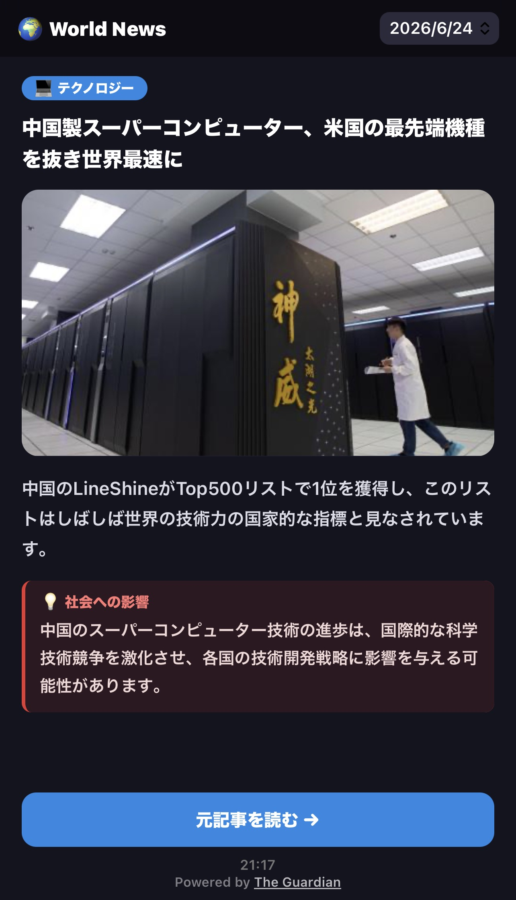

# 🌍 World News Digest

世界のIT・テクノロジーニュースを自動収集し、**AIで日本語に翻訳・要約**して、
スマホで **YouTubeショートのように** 1記事ずつ読めるニュースアプリ。
注目記事には「**社会への影響**」をAIが分析して添えます。

🔗 **公開サイト:** https://tafu42.github.io/world-news-digest/

<!-- スクリーンショットは docs/screenshot.png を追加すると下に表示されます -->
<p align="center">
  
</p>

---

## 特長

- **IT特化の信頼できる情報源**：The Guardian（テクノロジー）＋ Hacker News（海外IT）。
- **AI翻訳・要約**：英語ニュースを Gemini で日本語に翻訳・2行要約。
- **社会への影響**：注目記事に「起こりうる社会への影響」を Gemini が生成。
- **ショート風UI**：1記事＝1画面、上下スワイプ・画像つき・出典明記。
- **完全自動運用**：GitHub Actions が1日3回収集・2回 LINE 通知。**PC不要・無料運用**。
- **静的サイト**：GitHub Pages 配信でサーバー管理不要。

## システム構成

```
[GitHub Actions（cron）]
  ├─ 収集 3回/日 ── main.py
  │     ├─ The Guardian API（technology）＋ Hacker News API から取得
  │     ├─ 記事ページの og:image / og:description で画像・本文を補完
  │     ├─ 重複チェック（当日＋前日のURL・JSON）
  │     ├─ Gemini：① タイトル翻訳（最優先）② 要約 ③ 社会への影響
  │     └─ docs/data/YYYY-MM-DD.json に追記して自動コミット
  └─ 通知 2回/日 ── notify.py → LINE（更新＋サイトURL）
                    │
                    ▼
        [GitHub Pages（docs/）] ← 静的サイト（ショートUI）がJSONを読んで描画
```

## 使用技術

| 区分 | 技術 |
|------|------|
| 言語 | Python 3.11 / HTML・CSS・JavaScript |
| 自動実行（CI/CD） | GitHub Actions（cron） |
| ホスティング | GitHub Pages |
| ニュース | The Guardian Open Platform API / Hacker News API |
| AI | Gemini API（翻訳・要約・影響分析） |
| 通知 | LINE Messaging API |
| 秘匿情報 | GitHub Secrets / .env |

## 設計上の工夫

- **タイトル翻訳を最優先**：Geminiの無料枠が厳しくても、まずタイトルを翻訳。
  要約・影響が失敗しても一覧は日本語で読める「止まらない設計」。
- **失敗時の自動通知**：Geminiが上限・エラーのとき LINE に警告を送り、気づける。
- **疎結合な情報源**：収集層を差し替えるだけでソースを追加・変更可能
  （実際に Yahoo!ニュース版 → Guardian版 → Guardian＋Hacker News版へ移行）。
- **データ肥大化対策**：30日より古いデータは自動削除。画像はURL参照のみで保存しない。
- **ライセンス順守**：個人利用限定のソースは公開せず、再配信可能なソースに切り替えた。

## ライセンス・出典

- ニュースは [The Guardian Open Platform](https://open-platform.theguardian.com/)
  と [Hacker News API](https://github.com/HackerNews/API) を **非商用** で利用。
- サイトには記事ごとに出典を明記し、元記事へのリンクを掲載しています。
